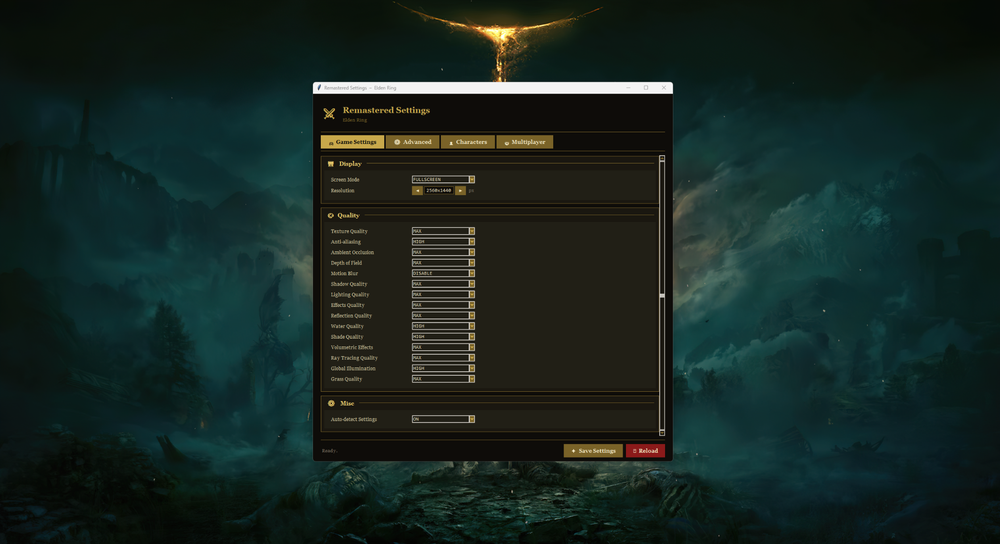
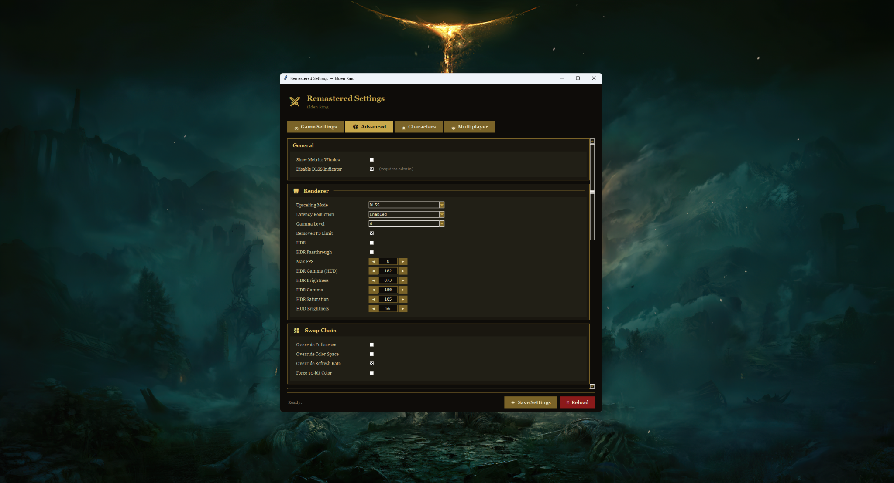
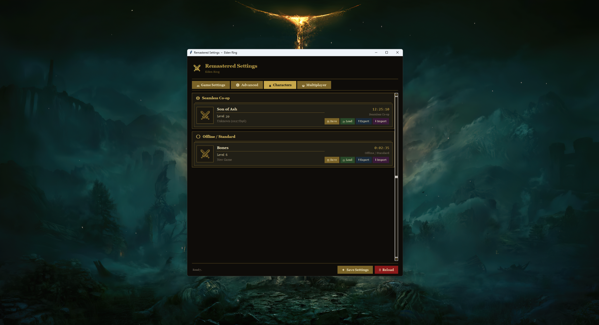
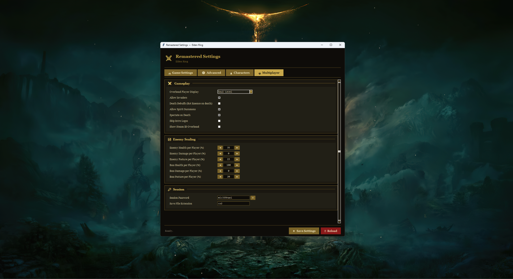

# Remastered Settings

**Remastered Settings** is a lightweight settings manager for modded **Elden Ring**, built to make modern graphics, multiplayer, and character management easier to access from one place.

Designed for use with **ERSS2** and the **Elden Ring multiplayer mod**.

## Features

- Modern graphics options provided by ERSS2
- DLSS, FSR, FSR3 Frame Generation, XeSS, NIS, HDR and more
- Removes the standard 60 FPS limitation and improves support for high-refresh-rate displays
- Quick access to Elden Ring's standard graphics settings
- Character-specific save slots with save/load, import and export
- Dedicated multiplayer settings
- Simple interface designed for quick configuration

## Screenshots

### Game Settings

### Advanced / ERSS2 Settings

### Character Save Slots

### Multiplayer Settings

## Requirements

This program is intended to be used with:

- **ERSS2** by Huutaiii
- **Elden Ring multiplayer mod**
- **Ultrawide Fix**
- **Remove Chromatic Aberration**

The game must be launched with **Easy Anti-Cheat disabled**.

The multiplayer mod will still function with Easy Anti-Cheat disabled.

### Mod Downloads

The required mods are available here:

**[Download ERSS2, Multiplayer Mod and Required Mods](https://1drv.ms/f/c/0e9560ecf4c7c28a/IgBOg4BhxaTlS5NYG5Fy9BBOAa3TB44fPvATv_L44QBcBG4)**

### Easy Anti-Cheat Toggler

An Easy Anti-Cheat toggler by **TechieW** is available on Nexus Mods:

**[Easy Anti-Cheat Toggler](https://www.nexusmods.com/eldenring/mods/90)**

Please follow the instructions provided on the Nexus Mods page for enabling or disabling Easy Anti-Cheat.

## Credits

**ERSS2 — Huutaiii**  
[Support Huutaiii on Patreon](https://www.patreon.com/huutaiii)

**Easy Anti-Cheat Toggler — TechieW**  
[TechieW's Nexus Mods page](https://www.nexusmods.com/eldenring/mods/90)

The multiplayer mod included in the provided mod package is an older version. The original project website is no longer available and I have been unable to locate the original creators.

If you are the creator of this multiplayer mod, or know who the original creators are, please contact me so I can provide proper credit and link to the original project.

Please support the original creators of all included mods whenever possible.

## Disclaimer

Remastered Settings is a third-party project and is not affiliated with or endorsed by FromSoftware or Bandai Namco Entertainment.

Use mods at your own risk and keep backups of your save files.

---

**Enjoy Remastered Settings and enjoy Elden Ring! ⚔️**
